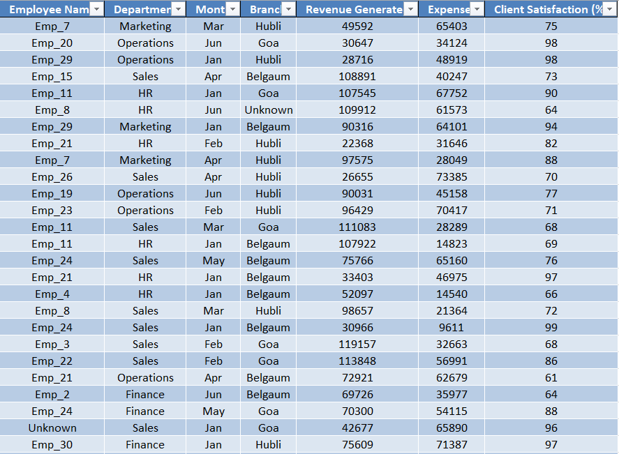
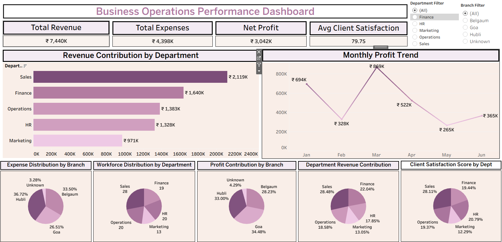

# Business Operations Performance Analysis

## Project Overview

Organizations need continuous monitoring of operational and financial performance to maintain profitability and efficiency. This project analyzes company data to evaluate department performance, profit trends, operational costs, workforce distribution, and customer satisfaction.

The interactive dashboard enables users to explore business performance dynamically through filters and visual analytics.

---

## Business Context

In many organizations, operational data is stored across multiple departments such as Sales, Finance, HR, Marketing, and Operations. Without a centralized analytics view, it becomes difficult for decision-makers to identify performance trends and inefficiencies.

This dashboard consolidates key operational metrics into a single interactive view, enabling business leaders to evaluate performance across departments and branches.

---

## Business Objective

The primary objectives of this project are:

- Analyze overall company financial performance.

- Evaluate revenue contribution across departments.

- Monitor monthly profit trends.

- Understand expense distribution across branches.

- Examine workforce allocation by department.

- Evaluate client satisfaction levels across departments.

- Identify opportunities for operational improvement and strategic decision making.

---

## Dataset Preview

Dataset Preview Image:

--- 

## Dataset Information

| Column Name             | Description                                                                                           |
| ----------------------- | ----------------------------------------------------------------------------------------------------- |
| Department              | Department responsible for business operations such as Sales, Finance, HR, Marketing, and Operations. |
| Branch                  | Branch location where business operations are conducted (e.g., Belgaum, Goa, Hubli).                  |
| Month                   | Month associated with revenue and profit performance.                                                 |
| Revenue                 | Total revenue generated by each department.                                                           |
| Expenses                | Total operational expenses incurred by the department or branch.                                      |
| Profit                  | Net profit calculated after deducting expenses from revenue.                                          |
| Employees               | Number of employees working in each department.                                                       |
| Client Satisfaction (%) | Client satisfaction score indicating service quality across departments.                              |

---

## Dashboard Preview

---

### Interactive Dashboard

The fully interactive dashboard is published on Tableau Public.

### Tableau Public Dashboard Link:

https://public.tableau.com/app/profile/sarvesh.vernekar/viz/business_operations_dashboard/BusinessOperationsPerformanceDashboard?publish=yes

---

## Dashboard Features

- Interactive filters for Department and Branch

- KPI cards summarizing key business metrics

- Department-level revenue comparison

- Monthly profit trend analysis

- Expense distribution across branches

- Workforce distribution analysis

- Profit contribution analysis by branch

- Client satisfaction analysis across departments

- These features allow users to explore business performance from multiple perspectives.

---

## Business Problems Addressed

This project helps answer several important business questions:

- Which departments generate the highest revenue?

- How does profit fluctuate across different months?

- Which branches incur the highest operational expenses?

- How is the workforce distributed across departments?

- Which branches contribute the most to company profitability?

- Which departments maintain the highest client satisfaction?

---

## Key Performance Indicators (KPIs)

The dashboard highlights the following key business metrics:

- **Total Revenue**

- **Total Expenses**

- **Net Profit**

- **Average Client Satisfaction**

These KPIs provide a quick overview of overall business performance.

---

## Key Insights

- The Sales department contributes the highest share of company revenue, making it the primary driver of business growth.

- Finance and Operations departments also contribute significant revenue, indicating strong operational support.

- Monthly profit fluctuates across different months, suggesting seasonal variations or operational changes affecting profitability.

- Goa branch contributes the highest share of profit, highlighting strong regional performance.

- Belgaum branch incurs the highest operational expenses, indicating a potential area for cost optimization.

- Workforce distribution shows that Sales and Operations departments have the largest employee base, reflecting their operational importance.

- Client satisfaction levels vary across departments, indicating potential service quality improvements in certain areas.

---

## Business Recommendations

Based on the analysis, the following strategic recommendations can improve operational performance:

- Strengthen High-Performing Departments
  Continue investing in the Sales department, as it drives the majority of company revenue.

- Improve Profit Stability
  Investigate causes of monthly profit fluctuations and implement strategies to stabilize revenue streams.

- Optimize Branch-Level Costs
  Conduct a detailed cost analysis for branches with higher expenses to improve operational efficiency.

- Enhance Client Experience
  Departments with lower client satisfaction scores should focus on service quality improvements and customer engagement.

- Balance Workforce Allocation
  Review employee distribution to ensure departments are adequately staffed for operational efficiency.

---

## Tools Used

- **Microsoft Excel** – Data preparation and organization

- **Tableau** – Data visualization and dashboard development

---

## Skills Demonstrated

- Data analysis and interpretation

- Data visualization and dashboard design

- Business performance analysis

- KPI development and monitoring

- Insight generation and storytelling

- Data-driven decision support

---

## Project Structure

business-operations-performance-analysis
│
├── dataset
│   └── business_operations_dataset.xlsx
│
├── dataset-preview
│   └── business_operations_dataset_excel.png
│
├── dashboard
│   └── business_operations_dashboard_tableau.png
│
├── tableau
│   └── business_operations_dashboard.twbx
│
└── README.md

---

## Repository Structure

**README.md** - Documentation explaining the project, insights, and business recommendations.

**business_operations_dataset.xlsx** - Contains the raw dataset used for analysis.

**business_operations_dataset_excel.png**- Contains preview images of the dataset structure.

**business_operations_dashboard_tableau.png** - Contains the Tableau dashboard screenshot.

**business_operations_dashboard.twbx** - Contains the Tableau workbook file used to build the dashboard.

---

## How to Use

1. Download the dataset from the dataset folder.

2. Open the Tableau workbook file located in the tableau folder.

3. Explore the dashboard using filters to analyze performance across departments and branches.

4. Review the insights and recommendations to understand business performance.

---

Author

**Sarvesh Vernekar**

Aspiring Data Analyst passionate about data analytics, visualization, and transforming business data into meaningful insights.
